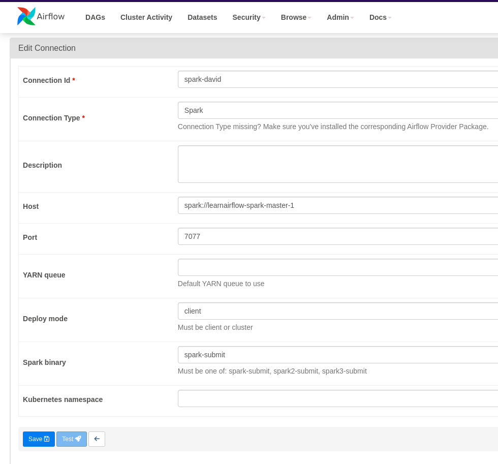

```sh
mkdir dags logs plugins config
echo -e "AIRFLOW_UID=$(id -u)\nAIRFLOW_GID=0" > .env

docker compose up airflow-init
docker compose up
```

http://localhost:8080

user/pass airflow

```sh
docker exec -it airflow-docker-airflow-webserver-1 airflow version
docker exec -it airflow-docker-airflow-webserver-1 bash
```

```sh
curl -X GET --user "airflow:airflow" "http//:localhost:8080/api/v1/dags"
```

## Apache Spark

Master http://localhost:9090/

SparkUI http://localhost:4040/

Necesitamos configurar la conexión:


Lanzar pyspark básico

```sh
spark-submit --name example_job_pyspark python/wordcountjob.py arg1 arg2
```

Para compilar con sbt básico
```sh
cd jobs/scala/wordcount
sbt compile publishLocal
```

# HDFS

Añadimos HDFS a nuestro cluster para usar con Spark

Tenemos un generador de datos y luego los subiremos a hdfs, para ello nos con
